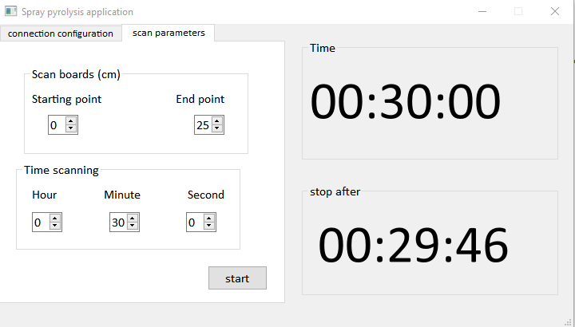

# Qt-based-Control-System-for-Spray-Pyrolysis-Machine

## Overview
This project develops an integrated control system for a spray pyrolysis machine utilizing Qt for the graphical user interface (GUI) and Arduino Uno for hardware control. The system enables real-time monitoring and precise control over the spray pyrolysis process, which is essential for creating thin films and nanomaterials. The setup allows operators to easily adjust and regulate crucial parameters such as temperature, and nozzle positioning.

# Features
- Control the scan parameters and the temperature of the spray pyrolysis substrate.
- visualization of process parameters(time)
- Communication between Arduino Uno and Qt using serial communication (USB)
- User-friendly GUI built with Qt to interact with the system.
# Components Used
## Hardware:
-	Arduino Uno :Used as the microcontroller to interface with sensors and actuators.
-	Power Supply: To power the Arduino Uno and peripherals (IR lamps...).
-	A digital temperature controller: Used OMRON E5AN-HAA2HBM-500.
-	A thermocouple type K: For monitoring the temperature of the heated substrate.
-	A spray nozzle :Used to atomize the precursor solution and position the nozzle.
-	Relay module: Control the movement of the spray nozzle with the pneumatic linear actuator.

## Software:
- Qt Creator: For developing the Qt-based GUI application.
- Arduino IDE: For programming the Arduino Uno.
- C++: The programming language used for developing the Qt application.
- Serial Communication: Used to send data between the Qt application and Arduino.

# Usage
The user can adjust parameters like time scanning and scan board. The control commands are sent to the Arduino to adjust the machine’s actuators.

1 - Open the App_Arduino.exe (Spray pyrolysis application), and configure the serial port to connect to the Arduino.

2 - Adjust the scan parameters using the GUI sliders and buttons.

3 - Start the spray pyrolysis process by clicking the "Start" button.

4 - The system will monitor the scheduled stop time.

## Contributing
Feel free to fork this project and contribute to improvements or bug fixes. If you have suggestions or questions, open an issue on the repository.
